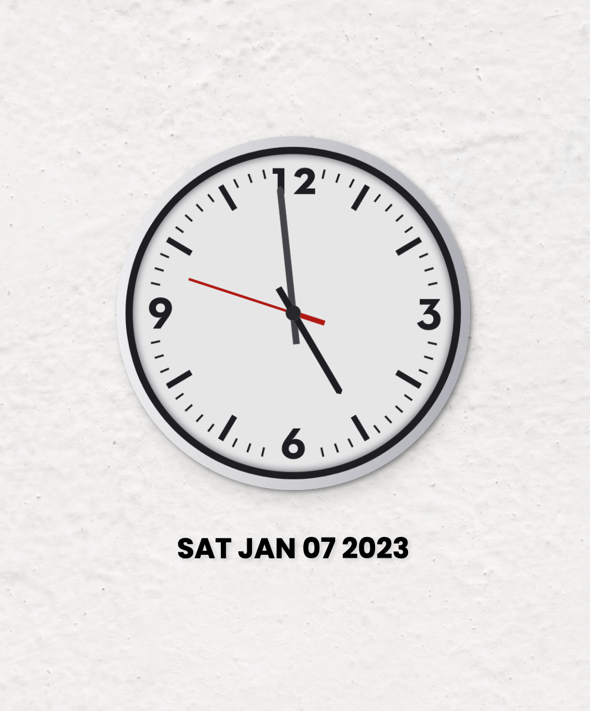

# Analog Clock

A simple front end analog clock using HTML, CSS and JavaScript.

## Live Demo

[Check it out here](https://emanuelefavero.github.io/analog-clock/)

#### Screenshot

## Features

- **Dark mode** - _toggle with the dark mode button in the top right corner_
- **Sound** - _toggle with the sound button in the top right corner_

> Note: The sound is really low, so you might not hear it, like a real clock!

## How to use locally

1. Clone the repository
2. Open the `index.html` file in your browser

## License

[MIT](LICENSE)
